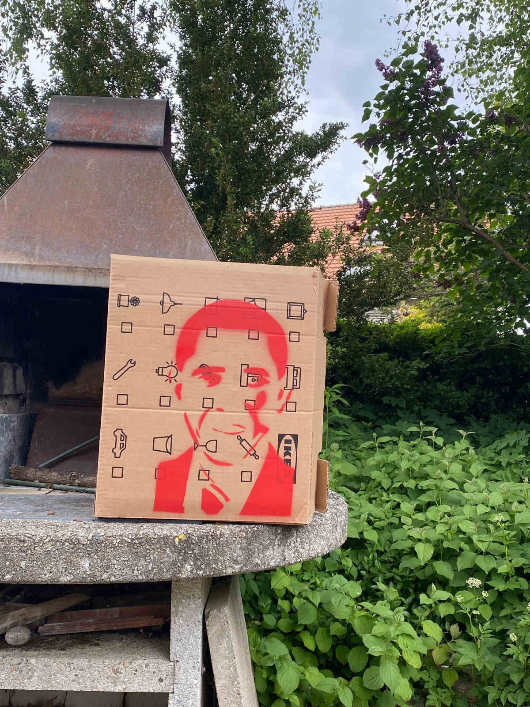

+++
title = "Erster Entwurf"
date = "2022-05-16"
draft = false
pinned = false
image = "microsoftteams-image-4-klein.jpg"
+++

Meinen Ersten Versuch habe ich nachdem ich die Schablone fertig gestellt hatte auf einer Umzugskiste aus Karton gemacht. Ich war eigentlich von beginn weg sehr zu frieden. Die Schablone hat sehr gut Funktioniert. Die Farbe ist auch nicht unter die Schablone gerutscht, sondern es wurde nur genau das farbig, was farbig werden sollte. Bei diesem Versuch habe ich mich für eine Spraydose der marke Montanablack entschieden. Da es mit Farben dieser Marke gut Funktioniert hat, habe ich auch für die weiteren Versionen mit eben diesen gearbeitet.