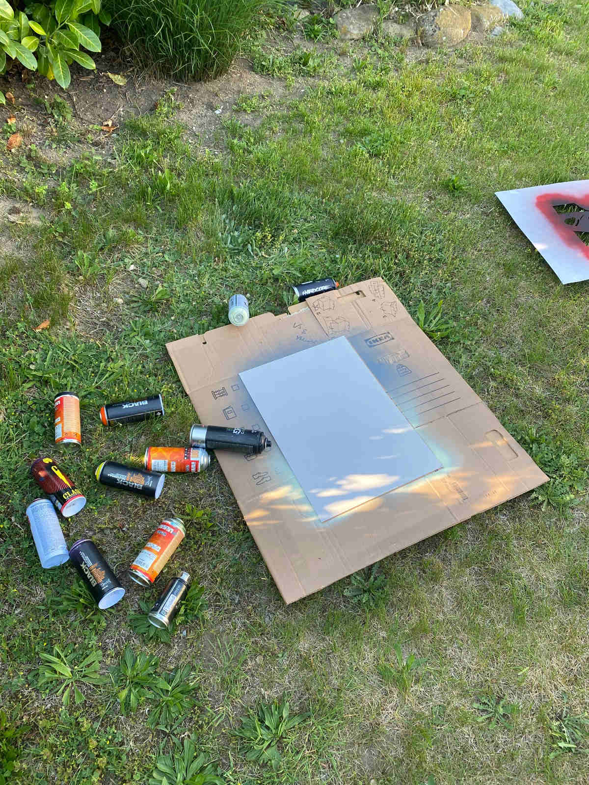
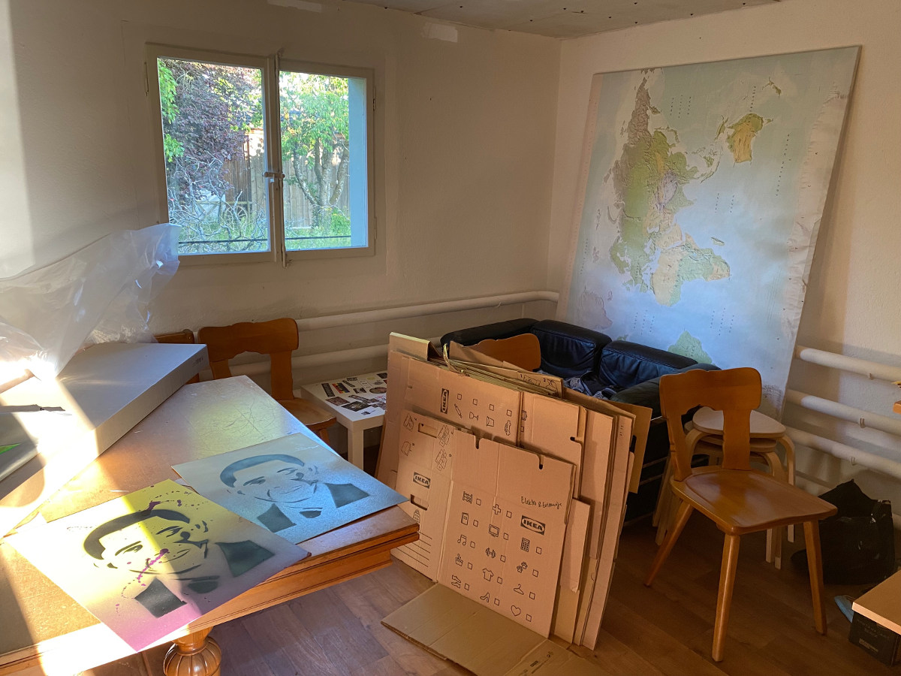

+++
title = "Mein Arbeitsplatz"
date = "2022-05-16"
draft = false
pinned = false
image = "microsoftteams-image-6-klein.jpg"
+++

Was man auf dem Foto gut sehen kann, ist wie ich gearbeitet habe. Ich habe eine Unterlage genommen und mich mit dieser in den Garten begeben. Dies war dank dem schönen Wetter auch ohne weiteres möglich. Falls es jedoch schlechtes Wetter gewesen wäre, hätte ich es auch im Freizeitraum machen können. Weil es dort jedoch ziemlich klein und indoor gewesen wäre, hätte ich wohl auf andere Dosen zurückgreifen müssen. In diesem Fall wären waterbased Farben sicher besser gewesen, weil dort nicht so viele schädliche Gase drin sind.

